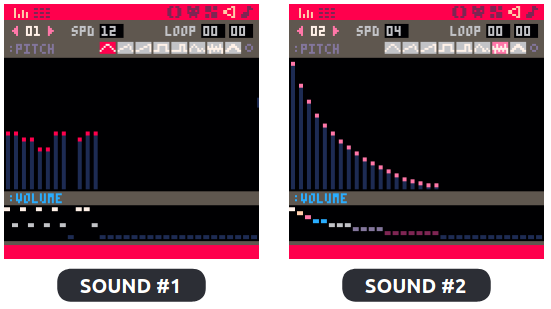
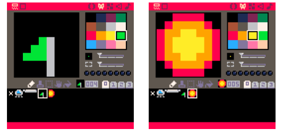

# Lander Pico-8

[Lander Demo](https://prototypecode.itch.io/lander-pico-8)

Find Steps:
- Ctrl + F
- 'step'

[Pico-8 Edu Edition](https://www.pico-8-edu.com/)


Canvas Size: 8 x 8 
---

## Step 1: Display Image

### Pg 0

```lua
function _init()
	make_player()
end

function _update()
end

function _draw()
	cls()
	draw_player()
end

function make_player()
	p = {}
	p.x = 60									--position
	p.y = 8
	p.dx = 0									--movement
	p.dy = 0
	p.sprite = 1
	p.alive = true
	p.thrust = 0.075
end

function draw_player()
	spr(p.sprite, p.x, p.y)
end
```

---

## Step 2: Add Gravity

### Pg 0 (Revised)

```lua
function _init()
	g = 0.025 		--gravity
	make_player()
end

function _update()
	move_player()
end

function move_player()
	p.dy += g 		--add gravity
	p.x += p.dx		--actually move
	p.y += p.dy 		--the player
end

function _draw()
	cls()
	draw_player()
end

function make_player()
	p = {}
	p.x = 60		--position
	p.y = 8
	p.dx = 0		--movement
	p.dy = 0
	p.sprite = 1
	p.alive = true
	p.thrust = 0.075
end

function draw_player()
	spr(p.sprite, p.x, p.y)
end
```

---

## Step 3: Add Thrust

Sound Editor:
- < 00 >
- SPD: 06
- LOOP: 00 00
- PITCH: 6 NOISE
	- NOTE 0: C1
- VOLUME: 2/7
 

### Pg 0 (Revised)

```lua
function _init()
	g = 0.025 		--gravity
	make_player()
end

function _update()
	move_player()
end

function move_player()
	p.dy += g 		--add gravity
	
	thrust()
	
	p.x += p.dx		--actually move
	p.y += p.dy 		--the player
end

function thrust()
	--add thrust to movement
	if (btn(0)) p.dx -= p.thrust
	if (btn(1)) p.dx += p.thrust
	if (btn(2)) p.dy -= p.thrust
	
	--thrust sound
	if (btn(0) or btn(1) or btn(2)) sfx(0)
end

function _draw()
	cls()
	draw_player()
end

function make_player()
	p = {}
	p.x = 60		--position
	p.y = 8
	p.dx = 0		--movement
	p.dy = 0
	p.sprite = 1
	p.alive = true
	p.thrust = 0.075
end

function draw_player()
	spr(p.sprite, p.x, p.y)
end
```

---

## Step 4: Stay On Screen

### Pg 0 (Revised)

```lua
function _init()
	g = 0.025 		--gravity
	make_player()
end

function _update()
	move_player()
end

function move_player()
	p.dy += g 		--add gravity
	
	thrust()
	
	p.x += p.dx		--actually move
	p.y += p.dy 		--the player
	
	stay_on_screen()
end

function stay_on_screen()
	if (p.x < 0) then		--left side
		p.x = 0
		p.dx = 0
	end
	if (p.x > 119) then --right side
		p.x = 119
		p.dx = 0
	end
	if (p.y < 0) then		--top side
		p.y = 0
		p.dy = 0
	end
end

function thrust()
	--add thrust to movement
	if (btn(0)) p.dx -= p.thrust
	if (btn(1)) p.dx += p.thrust
	if (btn(2)) p.dy -= p.thrust
	
	--thrust sound
	if (btn(0) or btn(1) or btn(2)) sfx(0)
end

function _draw()
	cls()
	draw_player()
end

function make_player()
	p = {}
	p.x = 60		--position
	p.y = 8
	p.dx = 0		--movement
	p.dy = 0
	p.sprite = 1
	p.alive = true
	p.thrust = 0.075
end

function draw_player()
	spr(p.sprite, p.x, p.y)
end
```

---

## Step 5: Add Stars

### Pg 0 (Revised)

```lua
function _init()
	g = 0.025 		--gravity
	make_player()
end

function _update()
	move_player()
end

function move_player()
	p.dy += g 		--add gravity
	
	thrust()
	
	p.x += p.dx		--actually move
	p.y += p.dy 		--the player
	
	stay_on_screen()
end

function stay_on_screen()
	if (p.x < 0) then		--left side
		p.x = 0
		p.dx = 0
	end
	if (p.x > 119) then --right side
		p.x = 119
		p.dx = 0
	end
	if (p.y < 0) then		--top side
		p.y = 0
		p.dy = 0
	end
end

function thrust()
	--add thrust to movement
	if (btn(0)) p.dx -= p.thrust
	if (btn(1)) p.dx += p.thrust
	if (btn(2)) p.dy -= p.thrust
	
	--thrust sound
	if (btn(0) or btn(1) or btn(2)) sfx(0)
end

function _draw()
	cls()
	draw_stars()
	draw_player()
end

function rndb(low, high)
	return flr(rnd(high - low + 1) + low)
end

function draw_stars()
	srand(1)
	for i=1, 50 do
		pset(rndb(0, 127), rndb(0, 127), rndb(5, 7))
	end
	srand(time())
end

function make_player()
	p = {}
	p.x = 60		--position
	p.y = 8
	p.dx = 0		--movement
	p.dy = 0
	p.sprite = 1
	p.alive = true
	p.thrust = 0.075
end

function draw_player()
	spr(p.sprite, p.x, p.y)
end
```

---

## Step 6: Add Ground

### Pg 0 (Revised)

```lua
function _init()
	g = 0.025 		--gravity
	make_player()
	make_ground()
end

function _update()
	move_player()
end

function move_player()
	p.dy += g 		--add gravity
	
	thrust()
	
	p.x += p.dx		--actually move
	p.y += p.dy 		--the player
	
	stay_on_screen()
end

function stay_on_screen()
	if (p.x < 0) then		--left side
		p.x = 0
		p.dx = 0
	end
	if (p.x > 119) then --right side
		p.x = 119
		p.dx = 0
	end
	if (p.y < 0) then		--top side
		p.y = 0
		p.dy = 0
	end
end

function thrust()
	--add thrust to movement
	if (btn(0)) p.dx -= p.thrust
	if (btn(1)) p.dx += p.thrust
	if (btn(2)) p.dy -= p.thrust
	
	--thrust sound
	if (btn(0) or btn(1) or btn(2)) sfx(0)
end

function _draw()
	cls()
	draw_stars()
	draw_ground()
	draw_player()
end

function rndb(low, high)
	return flr(rnd(high - low + 1) + low)
end

function draw_stars()
	srand(1)
	for i=1, 50 do
		pset(rndb(0, 127), rndb(0, 127), rndb(5, 7))
	end
	srand(time())
end

function make_player()
	p = {}
	p.x = 60		--position
	p.y = 8
	p.dx = 0		--movement
	p.dy = 0
	p.sprite = 1
	p.alive = true
	p.thrust = 0.075
end

function draw_player()
	spr(p.sprite, p.x, p.y)
end

function make_ground()
	--create the ground
	gnd = {}
	local top = 96		--highest point
	local btm = 120	--lowest point
	
	--set up the landing pad
	pad = {}
	pad.width = 15
	pad.x = rndb(0, 126-pad.width)
	pad.y = rndb(top, btm)
	pad.sprite = 2
	
	--create ground at pad
	for i = pad.x, pad.x + pad.width do
		gnd[i] = pad.y
	end
	
	--create ground right of pad
	for i = pad.x + pad.width + 1, 127 do
		local h = rndb(gnd[i - 1] - 3, gnd[i - 1] + 3)
		gnd[i] = mid(top, h, btm)
	end
	
	--create ground left of pad
	for i = pad.x - 1, 0, -1 do
		local h = rndb(gnd[i + 1] - 3, gnd[i + 1] + 3)
		gnd[i] = mid(top, h, btm)
	end
end

function draw_ground()
	for i = 0, 127 do
		line(i, gnd[i], i, 127, 5)
	end
end
```

---

## Step 7: Landing Pad


Canvas Size: 16 x 16

### Pg 0 (Revised)

```lua
function _init()
	g = 0.025 		--gravity
	make_player()
	make_ground()
end

function _update()
	move_player()
end

function move_player()
	p.dy += g 		--add gravity
	
	thrust()
	
	p.x += p.dx		--actually move
	p.y += p.dy 		--the player
	
	stay_on_screen()
end

function stay_on_screen()
	if (p.x < 0) then		--left side
		p.x = 0
		p.dx = 0
	end
	if (p.x > 119) then --right side
		p.x = 119
		p.dx = 0
	end
	if (p.y < 0) then		--top side
		p.y = 0
		p.dy = 0
	end
end

function thrust()
	--add thrust to movement
	if (btn(0)) p.dx -= p.thrust
	if (btn(1)) p.dx += p.thrust
	if (btn(2)) p.dy -= p.thrust
	
	--thrust sound
	if (btn(0) or btn(1) or btn(2)) sfx(0)
end

function _draw()
	cls()
	draw_stars()
	draw_ground()
	draw_player()
end

function rndb(low, high)
	return flr(rnd(high - low + 1) + low)
end

function draw_stars()
	srand(1)
	for i=1, 50 do
		pset(rndb(0, 127), rndb(0, 127), rndb(5, 7))
	end
	srand(time())
end

function make_player()
	p = {}
	p.x = 60		--position
	p.y = 8
	p.dx = 0		--movement
	p.dy = 0
	p.sprite = 1
	p.alive = true
	p.thrust = 0.075
end

function draw_player()
	spr(p.sprite, p.x, p.y)
end

function make_ground()
	--create the ground
	gnd = {}
	local top = 96		--highest point
	local btm = 120	--lowest point
	
	--set up the landing pad
	pad = {}
	pad.width = 15
	pad.x = rndb(0, 126-pad.width)
	pad.y = rndb(top, btm)
	pad.sprite = 2
	
	--create ground at pad
	for i = pad.x, pad.x + pad.width do
		gnd[i] = pad.y
	end
	
	--create ground right of pad
	for i = pad.x + pad.width + 1, 127 do
		local h = rndb(gnd[i - 1] - 3, gnd[i - 1] + 3)
		gnd[i] = mid(top, h, btm)
	end
	
	--create ground left of pad
	for i = pad.x - 1, 0, -1 do
		local h = rndb(gnd[i + 1] - 3, gnd[i + 1] + 3)
		gnd[i] = mid(top, h, btm)
	end
end

function draw_ground()
	for i = 0, 127 do
		line(i, gnd[i], i, 127, 5)
	end
	spr(pad.sprite, pad.x, pad.y, 2, 1)
end
```

---

## Step 8: Game Over Condition

### Pg 0 (Revised)

```lua
function _init()
	game_over = false
	win = false
	g = 0.025 		--gravity
	make_player()
	make_ground()
end

function _update()
	if (not game_over) then
		move_player()
		check_land()
	end
end

function check_land()
	l_x = flr(p.x) 					--left side of ship
	r_x = flr(p.x + 7)		--right side of ship
	b_y = flr(p.y + 7)		--bottom of ship
	
	over_pad = l_x >= pad.x and r_x <= pad.x + pad.width
	on_pad = b_y >= pad.y - 1
	slow = p.dy < 1
	
	if (over_pad and on_pad and slow) then
		end_game(true)
	elseif (over_pad and on_pad) then
		end_game(false)
	else
		for i = l_x, r_x do
			if (gnd[i] <= b_y) end_game(false)
		end
	end
end

function end_game(won)
	game_over=true
	win = won
end

function move_player()
	p.dy += g 		--add gravity
	
	thrust()
	
	p.x += p.dx		--actually move
	p.y += p.dy 		--the player
	
	stay_on_screen()
end

function stay_on_screen()
	if (p.x < 0) then		--left side
		p.x = 0
		p.dx = 0
	end
	if (p.x > 119) then --right side
		p.x = 119
		p.dx = 0
	end
	if (p.y < 0) then		--top side
		p.y = 0
		p.dy = 0
	end
end

function thrust()
	--add thrust to movement
	if (btn(0)) p.dx -= p.thrust
	if (btn(1)) p.dx += p.thrust
	if (btn(2)) p.dy -= p.thrust
	
	--thrust sound
	if (btn(0) or btn(1) or btn(2)) sfx(0)
end

function _draw()
	cls()
	draw_stars()
	draw_ground()
	draw_player()
end

function rndb(low, high)
	return flr(rnd(high - low + 1) + low)
end

function draw_stars()
	srand(1)
	for i=1, 50 do
		pset(rndb(0, 127), rndb(0, 127), rndb(5, 7))
	end
	srand(time())
end

function make_player()
	p = {}
	p.x = 60		--position
	p.y = 8
	p.dx = 0		--movement
	p.dy = 0
	p.sprite = 1
	p.alive = true
	p.thrust = 0.075
end

function draw_player()
	spr(p.sprite, p.x, p.y)
end

function make_ground()
	--create the ground
	gnd = {}
	local top = 96		--highest point
	local btm = 120	--lowest point
	
	--set up the landing pad
	pad = {}
	pad.width = 15
	pad.x = rndb(0, 126-pad.width)
	pad.y = rndb(top, btm)
	pad.sprite = 2
	
	--create ground at pad
	for i = pad.x, pad.x + pad.width do
		gnd[i] = pad.y
	end
	
	--create ground right of pad
	for i = pad.x + pad.width + 1, 127 do
		local h = rndb(gnd[i - 1] - 3, gnd[i - 1] + 3)
		gnd[i] = mid(top, h, btm)
	end
	
	--create ground left of pad
	for i = pad.x - 1, 0, -1 do
		local h = rndb(gnd[i + 1] - 3, gnd[i + 1] + 3)
		gnd[i] = mid(top, h, btm)
	end
end

function draw_ground()
	for i = 0, 127 do
		line(i, gnd[i], i, 127, 5)
	end
	spr(pad.sprite, pad.x, pad.y, 2, 1)
end
```

---

## Step 9: Winning & Losing Sounds



```lua
function _init()
	game_over = false
	win = false
	g = 0.025 		--gravity
	make_player()
	make_ground()
end

function _update()
	if (not game_over) then
		move_player()
		check_land()
	end
end

function check_land()
	l_x = flr(p.x)   --left side of ship
	r_x = flr(p.x+7) --right side of ship
	b_y = flr(p.y+7) --bottom of ship

	over_pad = l_x >= pad.x and r_x <= pad.x + pad.width
	on_pad = b_y >= pad.y-1
	slow = p.dy < 1
	
	if (over_pad and on_pad and slow) then
		end_game(true)
	elseif (over_pad and on_pad) then
		end_game(false)
	else
		for i = l_x, r_x do
			if (gnd[i] <= b_y) end_game(false)
		end
	end
end

function end_game(won)
	game_over = true
	win = won
	
	if (win) then
		sfx(1)
	else
		sfx(2)
	end
end

function move_player()
	p.dy += g 		--add gravity
	
	thrust()
	
	p.x += p.dx		--actually move
	p.y += p.dy 		--the player
	
	stay_on_screen()
end

function stay_on_screen()
	if (p.x < 0) then		--left side
		p.x = 0
		p.dx = 0
	end
	if (p.x > 119) then --right side
		p.x = 119
		p.dx = 0
	end
	if (p.y < 0) then		--top side
		p.y = 0
		p.dy = 0
	end
end

function thrust()
	--add thrust to movement
	if (btn(0)) p.dx -= p.thrust
	if (btn(1)) p.dx += p.thrust
	if (btn(2)) p.dy -= p.thrust
	
	--thrust sound
	if (btn(0) or btn(1) or btn(2)) sfx(0)
end

function _draw()
	cls()
	draw_stars()
	draw_ground()
	draw_player()
end

function rndb(low, high)
	return flr(rnd(high - low + 1) + low)
end

function draw_stars()
	srand(1)
	for i=1, 50 do
		pset(rndb(0, 127), rndb(0, 127), rndb(5, 7))
	end
	srand(time())
end

function make_player()
	p = {}
	p.x = 60		--position
	p.y = 8
	p.dx = 0		--movement
	p.dy = 0
	p.sprite = 1
	p.alive = true
	p.thrust = 0.075
end

function draw_player()
	spr(p.sprite, p.x, p.y)
end

function make_ground()
	--create the ground
	gnd = {}
	local top = 96		--highest point
	local btm = 120	--lowest point
	
	--set up the landing pad
	pad = {}
	pad.width = 15
	pad.x = rndb(0, 126-pad.width)
	pad.y = rndb(top, btm)
	pad.sprite = 2
	
	--create ground at pad
	for i = pad.x, pad.x + pad.width do
		gnd[i] = pad.y
	end
	
	--create ground right of pad
	for i = pad.x + pad.width + 1, 127 do
		local h = rndb(gnd[i - 1] - 3, gnd[i - 1] + 3)
		gnd[i] = mid(top, h, btm)
	end
	
	--create ground left of pad
	for i = pad.x - 1, 0, -1 do
		local h = rndb(gnd[i + 1] - 3, gnd[i + 1] + 3)
		gnd[i] = mid(top, h, btm)
	end
end

function draw_ground()
	for i = 0, 127 do
		line(i, gnd[i], i, 127, 5)
	end
	spr(pad.sprite, pad.x, pad.y, 2, 1)
end
```

---

## Step 10: Win & Lose Sprites



### Pg 0 (Revised)

```lua
function _init()
	game_over = false
	win = false
	g = 0.025 		--gravity
	make_player()
	make_ground()
end

function _update()
	if (not game_over) then
		move_player()
		check_land()
	end
end

function check_land()
	l_x = flr(p.x)   --left side of ship
	r_x = flr(p.x+7) --right side of ship
	b_y = flr(p.y+7) --bottom of ship

	over_pad = l_x >= pad.x and r_x <= pad.x + pad.width
	on_pad = b_y >= pad.y-1
	slow = p.dy < 1
	
	if (over_pad and on_pad and slow) then
		end_game(true)
	elseif (over_pad and on_pad) then
		end_game(false)
	else
		for i = l_x, r_x do
			if (gnd[i] <= b_y) end_game(false)
		end
	end
end

function end_game(won)
	game_over = true
	win = won
	
	if (win) then
		sfx(1)
	else
		sfx(2)
	end
end

function move_player()
	p.dy += g 		--add gravity
	
	thrust()
	
	p.x += p.dx		--actually move
	p.y += p.dy 		--the player
	
	stay_on_screen()
end

function stay_on_screen()
	if (p.x < 0) then		--left side
		p.x = 0
		p.dx = 0
	end
	if (p.x > 119) then --right side
		p.x = 119
		p.dx = 0
	end
	if (p.y < 0) then		--top side
		p.y = 0
		p.dy = 0
	end
end

function thrust()
	--add thrust to movement
	if (btn(0)) p.dx -= p.thrust
	if (btn(1)) p.dx += p.thrust
	if (btn(2)) p.dy -= p.thrust
	
	--thrust sound
	if (btn(0) or btn(1) or btn(2)) sfx(0)
end

function _draw()
	cls()
	draw_stars()
	draw_ground()
	draw_player()
end

function rndb(low, high)
	return flr(rnd(high - low + 1) + low)
end

function draw_stars()
	srand(1)
	for i=1, 50 do
		pset(rndb(0, 127), rndb(0, 127), rndb(5, 7))
	end
	srand(time())
end

function make_player()
	p = {}
	p.x = 60		--position
	p.y = 8
	p.dx = 0		--movement
	p.dy = 0
	p.sprite = 1
	p.alive = true
	p.thrust = 0.075
end

function draw_player()
	spr(p.sprite, p.x, p.y)
	if (game_over and win) then
		spr(4, p.x, p.y - 8) --flag
	elseif (game_over) then
		spr(5, p.x, p.y) --explosion
	end
end

function make_ground()
	--create the ground
	gnd = {}
	local top = 96		--highest point
	local btm = 120	--lowest point
	
	--set up the landing pad
	pad = {}
	pad.width = 15
	pad.x = rndb(0, 126-pad.width)
	pad.y = rndb(top, btm)
	pad.sprite = 2
	
	--create ground at pad
	for i = pad.x, pad.x + pad.width do
		gnd[i] = pad.y
	end
	
	--create ground right of pad
	for i = pad.x + pad.width + 1, 127 do
		local h = rndb(gnd[i - 1] - 3, gnd[i - 1] + 3)
		gnd[i] = mid(top, h, btm)
	end
	
	--create ground left of pad
	for i = pad.x - 1, 0, -1 do
		local h = rndb(gnd[i + 1] - 3, gnd[i + 1] + 3)
		gnd[i] = mid(top, h, btm)
	end
end

function draw_ground()
	for i = 0, 127 do
		line(i, gnd[i], i, 127, 5)
	end
	spr(pad.sprite, pad.x, pad.y, 2, 1)
end
```

---

## Step 11: Restart Screen

### Pg 0 (Revised)

```lua
function _init()
	game_over = false
	win = false
	g = 0.025 		--gravity
	make_player()
	make_ground()
end

function _update()
	if (not game_over) then
		move_player()
		check_land()
	else
		if (btnp(5)) _init()
	end
end

function check_land()
	l_x = flr(p.x)   --left side of ship
	r_x = flr(p.x+7) --right side of ship
	b_y = flr(p.y+7) --bottom of ship

	over_pad = l_x >= pad.x and r_x <= pad.x + pad.width
	on_pad = b_y >= pad.y-1
	slow = p.dy < 1
	
	if (over_pad and on_pad and slow) then
		end_game(true)
	elseif (over_pad and on_pad) then
		end_game(false)
	else
		for i = l_x, r_x do
			if (gnd[i] <= b_y) end_game(false)
		end
	end
end

function end_game(won)
	game_over = true
	win = won
	
	if (win) then
		sfx(1)
	else
		sfx(2)
	end
end

function move_player()
	p.dy += g 		--add gravity
	
	thrust()
	
	p.x += p.dx		--actually move
	p.y += p.dy 		--the player
	
	stay_on_screen()
end

function stay_on_screen()
	if (p.x < 0) then		--left side
		p.x = 0
		p.dx = 0
	end
	if (p.x > 119) then --right side
		p.x = 119
		p.dx = 0
	end
	if (p.y < 0) then		--top side
		p.y = 0
		p.dy = 0
	end
end

function thrust()
	--add thrust to movement
	if (btn(0)) p.dx -= p.thrust
	if (btn(1)) p.dx += p.thrust
	if (btn(2)) p.dy -= p.thrust
	
	--thrust sound
	if (btn(0) or btn(1) or btn(2)) sfx(0)
end

function _draw()
	cls()
	draw_stars()
	draw_ground()
	draw_player()
	
	if (game_over) then
		if (win) then
			print("you win!", 48, 48, 11)
		else
			print("too bad!", 48, 48, 8)
		end
		print("press ❎ to play again", 20, 70, 5)
	end	
end

function rndb(low, high)
	return flr(rnd(high - low + 1) + low)
end

function draw_stars()
	srand(1)
	for i=1, 50 do
		pset(rndb(0, 127), rndb(0, 127), rndb(5, 7))
	end
	srand(time())
end

function make_player()
	p = {}
	p.x = 60		--position
	p.y = 8
	p.dx = 0		--movement
	p.dy = 0
	p.sprite = 1
	p.alive = true
	p.thrust = 0.075
end

function draw_player()
	spr(p.sprite, p.x, p.y)
	if (game_over and win) then
		spr(4, p.x, p.y - 8) --flag
	elseif (game_over) then
		spr(5, p.x, p.y) --explosion
	end
end

function make_ground()
	--create the ground
	gnd = {}
	local top = 96		--highest point
	local btm = 120	--lowest point
	
	--set up the landing pad
	pad = {}
	pad.width = 15
	pad.x = rndb(0, 126-pad.width)
	pad.y = rndb(top, btm)
	pad.sprite = 2
	
	--create ground at pad
	for i = pad.x, pad.x + pad.width do
		gnd[i] = pad.y
	end
	
	--create ground right of pad
	for i = pad.x + pad.width + 1, 127 do
		local h = rndb(gnd[i - 1] - 3, gnd[i - 1] + 3)
		gnd[i] = mid(top, h, btm)
	end
	
	--create ground left of pad
	for i = pad.x - 1, 0, -1 do
		local h = rndb(gnd[i + 1] - 3, gnd[i + 1] + 3)
		gnd[i] = mid(top, h, btm)
	end
end

function draw_ground()
	for i = 0, 127 do
		line(i, gnd[i], i, 127, 5)
	end
	spr(pad.sprite, pad.x, pad.y, 2, 1)
end
```

---
