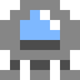

# Lander Pico-8

[Pico-8 Edu Edition](https://www.pico-8-edu.com/)



Canvas Size: 8 x 8 
---

## Step 1: Display Image

### Pg 0

```lua
function _init()
	make_player()
end

function _update()
end

function _draw()
	cls()
	draw_player()
end

function make_player()
	p = {}
	p.x = 60									--position
	p.y = 8
	p.dx = 0									--movement
	p.dy = 0
	p.sprite = 1
	p.alive = true
	p.thrust = 0.075
end

function draw_player()
	spr(p.sprite, p.x, p.y)
end
```

---

## Step 2: Add Gravity

### Pg 0 (Revised)

```lua
function _init()
	g = 0.025 		--gravity
	make_player()
end

function _update()
	move_player()
end

function move_player()
	p.dy += g 		--add gravity
	p.x += p.dx		--actually move
	p.y += p.dy 		--the player
end

function _draw()
	cls()
	draw_player()
end

function make_player()
	p = {}
	p.x = 60		--position
	p.y = 8
	p.dx = 0		--movement
	p.dy = 0
	p.sprite = 1
	p.alive = true
	p.thrust = 0.075
end

function draw_player()
	spr(p.sprite, p.x, p.y)
end
```

---

## Step 3: Add Thrust

### Pg 0 (Revised)

```lua
function _init()
	g = 0.025 		--gravity
	make_player()
end

function _update()
	move_player()
end

function move_player()
	p.dy += g 		--add gravity
	
	thrust()
	
	p.x += p.dx		--actually move
	p.y += p.dy 		--the player
end

function thrust()
	--add thrust to movement
	if (btn(0)) p.dx -= p.thrust
	if (btn(1)) p.dx += p.thrust
	if (btn(2)) p.dy -= p.thrust
	
	--thrust sound
	if (btn(0) or btn(1) or btn(2)) sfx(0)
end

function _draw()
	cls()
	draw_player()
end

function make_player()
	p = {}
	p.x = 60		--position
	p.y = 8
	p.dx = 0		--movement
	p.dy = 0
	p.sprite = 1
	p.alive = true
	p.thrust = 0.075
end

function draw_player()
	spr(p.sprite, p.x, p.y)
end
```

---
